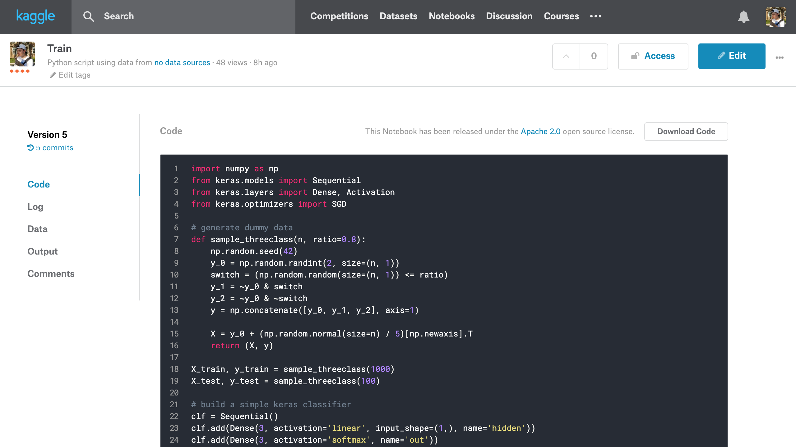

======
Kaggle
======

.. image:: ../_static/kaggle-kernels-screenshot.png

Overview
--------

`Kaggle Kernels <https://www.kaggle.com/kernels>`_ are a completely free cloud compute environment provided by `Kaggle <https://www.kaggle.com/>`_. Kaggle Kernels differ from the other drivers available in ``fahr`` in that they were designed to be used and shared inside of Kaggle's community of machine learners, and as a result they are very beginner-friendly and easy to get started with but are not be the best fit for more serious computational work.

To learn more about this product see the article `"Introduction to Kaggle Kernels" <https://towardsdatascience.com/introduction-to-kaggle-kernels-2ad754ebf77>`_.

Specs
-----

Kaggle Kernel instances are free to use for registered users. At time of writing, they provide the following resources:

* 9 hours of execution time
* 24 GB of disk space
* 17 GB of RAM
* 4 CPU cores
* 2 GPU cores with 14 GB of GPU RAM total (optional extra)
* Internet access (optional extra)

How it works
------------

Kaggle Kernels run inside of a default Docker container that is built and maintained by their team. This environment cannot be modified using the API, and hence, ``fahr``.

To execute a new training job you submit a model definition and a ``kernel-metadata.json`` metadata file to Kaggle. Any file written to the home path and certain other paths on disk during execution is considered a kernel output and will be availabe for download after execution finishes. A logfile capturing output ``STDOUT`` and ``STDERR`` is also provided.

Prerequisites
-------------

You will need to create an account on Kaggle. To do this, visit their website.

You will need to create a Kaggle API key and download that to a specific location on your local disk. You can create a new token by visiting the API section of your user settings. You will need to download that token to ``~/.kaggle/kaggle.json`` on Linux and macOS or ``C:\Users\<Windows-username>\.kaggle\kaggle.json`` on Windows.

Basic usage
-----------

To run a training job in a Kaggle kernel:

.. code-block:: bash

    $ fahr fit $MODEL_ARTIFACT_FILEPATH \
        --train-driver='kaggle' \
        --config.username=$USERNAME

Where ``$MODEL_ARTIFACT_FILEPATH`` is the path to your model artifact and ``$USERNAME`` is your Kaggle username.

The will create a new ``$USERNAME/$FILENAME`` kernel on Kaggle, or a new version of this kernel if it already exists. You will be given a link to the online kernel page, which you can use to monitor its status.

To download the model artifacts from a completed training job:

.. code-block:: bash

    $ fahr fetch  --train-driver='kaggle' ./ $USERNAME/$FILENAME

Limitations
-----------

The kernel runtime environment is hard-coded and cannot be extended remotely, so you're stuck with the packages Kaggle gives you.

Advanced configuration
----------------------

The following configuration options are available for ``fahr fit``:

* ``enable_gpu`` - Train in a GPU environment. To enable pass ``--config.enable_gpu=True``.
* ``enable_internet`` - Train in an Internet-connected environment. To enable pass ``--config.enable_internet=True``.
* ``is_private`` - Whether the resultant kernel is publicly visible or not. Defaults to ``False`` (public). To make your kernel private pass ``--config.is_private``.
* ``dataset_sources`` - What `Kaggle Datasets <https://www.kaggle.com/datasets>`_ to include in the kernel environment. Defaults to ``None``. To add datasets to the environment pass ``--config.dataset_sources=["owner/dataset", "otherowner/otherdataset"]``.
* ``kernel_sources`` - What  Kaggle Kernel data outputs to include in the kernel environment as input datasets. Defaults to ``None``. To add datasets to the environment pass ``--config.kernel_sources=["user/kernelname", "otheruser/otherkernelname"]``.
* ``competition_sources`` - What `Kaggle Competitions <https://www.kaggle.com/competitions>`_ data to include in the kernel environment. Only active competitions may have their data included in this way via the API, and you must have already agreed to the rules of the competition via the Kaggle website. To add competition data to the environment pass ``--config.competition_sources=["owner/dataset", "otherowner/otherdataset"]``.
